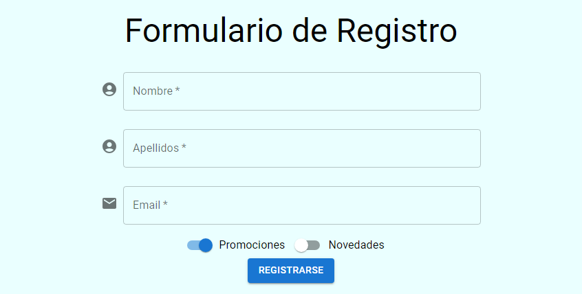

# Resolución del Desafío Curso React: Function Components

En el curso 5 de la formación React G5 ONE se utiliza la librería Material UI para crear un formulario de registro.Ya en la parte final del curso, se enseña cómo realizar la validación del campo Nombre del formulario. Sin embargo, el instructor deja como desafío el realizar la validación de los campos Apellidos y Email. Dicho desafío lo he realizado con éxito utilizando el spread operator junto con la re-creación de un atributo ya declarado en el objeto que se destructura. Básicamente, se cumple que:

Si tengo un objeto ya sea: `objeto={a:1,b:2,c:3}` y si creo en ese objeto un nuevo valor para un atributo ya existene al **final** de todo el resto de atributos, el nuevo objeto tendrá los mismos tres atributos pero el atributo que estaba repetido ahora tendrá como valor el último valor en la secuencia de declaración, es decir, si tengo esto: `objeto={a:1,b:2,c:3,a:555}` esto será considerado como: `objeto={a:555,b:2,c:3}`. Lo anterior se puede comprobar en un entorno de ejecución de JavaScript ya sea usando Node.js o directamente en la consola del navegador. En general, cuando exista duda de algún concepto quizás algo abstracto lo ideal es siempre hacerlo concreto (**reify**) usando Node.js.

Además, he instalado la librería SweetAlert para mostrar una bonita alerta cuando el registro se realiza de manera exitosa. Las imagenes del proyecto finalizado son las siguientes:

### Formulario

### Formulario Validado

### Formulario con registro exitoso

